# [**Learnpulse**](https://learnpulse-ms3.herokuapp.com/)
## Milestone Project 3
### General Purpose and Introduction
Learnpulse is a command line interface data entry and search application used specifically for recording and displaying core learning and development data for new inductees within a business. The system itself makes use of two APIs to store the trainee data:
1.	Google Drive
2.	Gspread
## Table of Contents
* ### [Deployed Site](#Deployed-Website)
* ### [Demo](#Site-Demonstration)
* ### [UX](#User-Experience)
* ### [Features](#Functional-Features)
* ### [Technologies](#Technologies-Used)
* ### [Testing](#Application-Testing)
* ### [Deployment](#Deploying-the-site)
* ### [Reflection](#Project-Reflection)
* ### [Further Development](#Further-Development-Scope)
* ### [Credits](#Project-Credits)
* ### [Acknowledgement](#Project-Acknowledgements)
# [Deployed Website](https://learnpulse-ms3.herokuapp.com/)
By clicking the hyperlinked header above, you can access the final deployed site hosted on Heroku.
# **Site Demonstration**
## 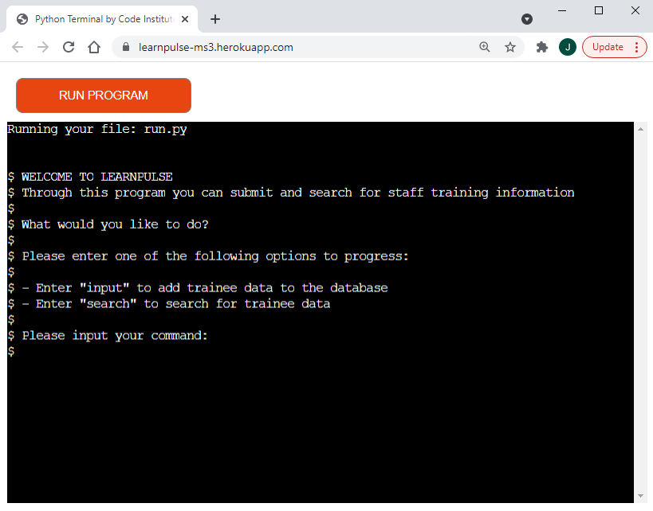
# **User Experience**
In this section, I will discuss the user experience considerations I implemented during the development process.
## **Strategy**
### **Business Goals**
As this is a business oriented back end system, there are some business goals I considered during the planning and development process.
* The system needed to be intuitive and allow ease of learning so that any staff required to record the data would be able to do so easily. 
* The system would need to provide some wiggle room for human error whilst also implementing strong validation to ensure consistency of data.
* The system would need to have some sort of search functionality to allow auditors or senior stakeholders to review a trainee’s information.  
### **User Stories**
Below are the user stories that needed to be fulfilled for the project to be successful from the perspective of the user:
* To navigate the application with ease through intuitive guidance and direction.
* To understand the purpose of the application.
* To be able to input trainee data.
* To be able to search for trainee data.
* To be able to get out of the application at specific breakpoints or back out of an application function if a mistake is made.
### **Planning**
To ensure that I entered the development phase of this project, I decided to create a plan using Microsoft Visio of how the logic of the program would work. I have attached an image of the plan below. Please note: the project has evolved to promote a more positive user experience since the planning phase so some functionality may be different.  
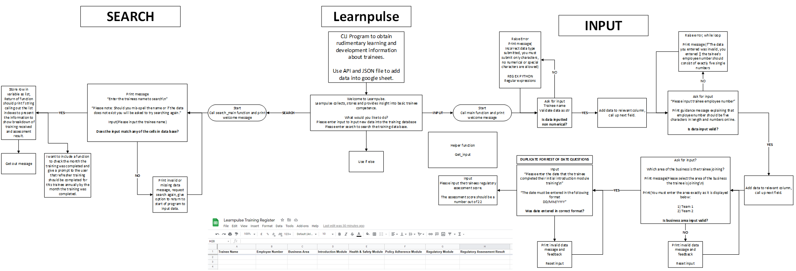  
# **Functional Features**
## General
Before I explain each function in the project and the considerations made when calling said functions, I would like summarise on the applications functionality and purpose. Learpulse is a purely backend python project. The application makes use of two APIs in Google Drive and gspread. Through the course of the application, the users journey branches dependant on the functionality they wish to use. The branches are as follows:  
* **Branch 1** - The user can enter an input command and they will be taken to the input section of the program where they make use of multiple inputs all of which append to a list, which is then in turn inserted into a google sheet via the aforementioned APIs. 
* **Branch 2** - The user can enter a search command and they will be taken to the search section of the program where they can enter the name of a previously submitted trainee, and provided the data exists in the spreadsheet, the data will be pulled out as a list and passed to a function to display the trainee’s learning report.
I will now list the functional specification of the application in the order in which the functions are called with a detailed breakdown of how each function operates and the considerations that must be made when the functions are called.
## Functions & Detailed Logic Breakdown
* **main_program_call()** - This function is the main function of the program. Think of it as the centre point the program with all other functions more or less being called within it. This function does use some conditional logic to decide which of the other functions are required to call. But as I mentioned above, it can be broken down into two sections: one section for the input functionality and one section for the search functionality. I will remark where other functions pass data to this function as and when they come up.

* **welcome_function()** - This is the first function that is called inside main_program_call(). It takes no parameters and is designed to start the program off. It provides guidance to the purpose of the application and provides the user with a functionality choice. The function is essentially a data loop making use of a while loop and if/else statements to determine if the user has entered a valid command. To make things easier for the user, I assign the variable containing the input to another variable where I can add the lower method meaning that users who use all caps or a capital letter at the start of their command are not sent around the loop again. There are two commands to choose from which are listed below:

    * **“input”** – This command is verified via if/else blocks. If the user enters this command in a valid fashion, the function returns the input from the user back to where the function was called. The return is assigned to a variable in main_program_call named branching_variable. This is then assessed with an if/else branch in the main_function_call function and if it is “input”, then the input branch of the function and the subsequent input subfunctions will execute.
    * **“search”** – This command is also verified in the function via if/else blocks. If the user enters this command in a valid fashion, the function return is again passed into the branching_variable within the main_program_call function where it subsequently executes the else block which causes the search functionality and subfunctions to execute.  

    If the user enters anything other than these two commands exactly, the else block within the while executes providing an invalid command message and continues the loop so that the user can enter the command again until valid input is provided.  

* **input_function_check() & search_function_check()** - It is easier to explain these functions together as they do the same thing apart from asking separate questions. I wanted to allow a user the chance to back out of a program branch before they fully commit to it in case they enter the wrong command by accident as familiar use of the system and muscle memory could play into the user entering the wrong command. For that purpose, I implemented these two functions to ask the user a question based on their previous input. These functions follow the same logic as previous functions by allowing input contained within a while loop which is converted to uppercase with a variable re-assingment duly assessed by an if/else statement to ensure valid input. There are two possible commands:
    * **“Y”** – If the user enters this command, the function following the checks will run so for the input function check function, the input blocks will execute and the same for the search blocks.
    * **“N”** – If the user enters this command, the main_program_call function is called again which restarts the application. Due to the very short progression through the application, this is not a bad user journey as it will allow them to enter the input they meant to enter upon the program starting.  

    If the user enters an invalid command, the else blocks of these functions execute and the while loop is continued with an invalid command message prompting the user to enter a valid command.
### **Input Branch**
* **collect_trainee_personell_data()** - This function is the first subfunction called when the user fully commits to the input branch of the program and it is the point of the program where the user can begin to enter more dynamic inputs. Guidance is provided to user in caps to inform the user that the data input branch of the program is running. Then the trainee_personell_data_row is declared as an empty list. This function services the first three columns in the google sheet by obtaining three pieces of data about the trainee:
    * **Full Name** - Like the rest of the logic within the program, to ensure valid and consistent data, this input is contained with in a while loop that continues when invalid input is provided whilst also providing feedback to user. The users input here is validated via Regular Expressions which is a built in python module imported at the top of the file via the “import re” statement. The if statement checks the users input against the regular expression to ensure that the Full Name of the trainee being entered only consists of alpha characters and white spaces. If the input is valid, the user’s input is appended to the empty trainee_personell_data_row list, a feedback message is provided to let the user know their input was successful and the while loop is broken so that the function execution can continue. As usual, if the input is invalid, the else block is executed which informs the user that the input was invalid and the while loop is continued so that the user can enter a valid input.

    * **Employee Number** - The logic is the same for this input as it is contained within a while loop and the input is assessed by an if/else statement. The user must enter a five digit number to serve as the trainee’s employee number. This is verified in the if statement by using the isdigit() and len() methods. If the user supplies valid input, the employee number is appended to the trainee_personell_data_row and the loop is broken. If invalid input is provided the else block is executed and a dynamic f string feedback message is provided to the user advising that they must enter only five digits and the loop is then continued until valid input is provided.

    * **Team Assignment** - The final input of this function requests that the user issue a team assignment command. Like the rest of the logic, this input is contained within a while loop and verified via a nested if/else statement. The user is provided with two commands to enter:
        * **“1”** – This command takes the input variable and assigns it a value of “Team 1” then appends the variable to the trainee_personell_data_row list, a feedback message is printed to the user and the while loop is broken.
        * **“2”** – This command does the same but executes the elif block of the if else statement which does the same as the if statement but re-assigns the input variable so that it has a value of “Team 2”. The variable is also then appended to the trainee_personell_data_row list, a feedback message is printed to the user and the while loop is broken.  
    
    If no valid command is provided, the else block within the loop is executed a feedback message is provided to the user and the loop is continued until valid input is provided. Once the each of the above loops has been broken, the function returns a now completed trainee_personell_data_row list to the main_program_call function and assigns it to a variable called trainee_data_row. This variable is then added to by the other input subfunctions.

* **collect_trainee_training_dates(module)** - This function as the name might suggest is designed to obtain the training dates of the trainee from the user. The function takes one parameter “module” which is the name of the module for which the date of training needs to be obtained. This function is called multiple times within the main_program_call function and you will notice that each time it is called, the name of the module in string format is passed in as an argument and stored in the module parameter. This is then injected using f strings into the guidance for the user within the function. The logic of the function remains the same as the other functions within the input group of subfunctions whereby the input is looped using a while loop and assessed with an if/else statement.  
This input is verified again using regular expressions to ensure that the date is in European and DD/MM/YYYY format. Provided that the user enters a valid input, the input variable is returned from the function back to where the function is called inside the main_program_call function. The return is then stored in a variable name of associated to the arguments passed in. For example, the first time the dates function is called, the return is stored in a variable named intro_mod_date, which is then itself appended to the existing trainee_data_row list which was the variable storing the data already collected by the collect_trainee_personell_data function. Each time the function is called, the return is stored in an associating variable and then appended directly after the function call to the trainee_data_row list. It is this constant construction of the list which builds the data set to be inserted into the google sheet. One caveat to add here is the importance of the function order within main_function_call as it must be inline with order of the columns on the google sheet. If invalid data is provided, the loop is continued and a dynamic f string feedback message is provided.

* **collect_assessment_scores(ass_name, ass_score_total)** -  This function collects the trainee’s assessment scores. It takes two arguments into parameters named “ass_name” which is how the name of the assessment is inserted into the function when it is called and "ass_score_total" which takes the total amount of marks available for the assessment using that particular call of the function. Both are passed in as a string but ass_score_total is converted to an integer to so that the user’s input can be verified. This function is only called once to obtain the trainee’s regulatory assessment score but the scope of this function could be applied to any assessment the business or developer would require provided it is called in the relevant order and passed arguments correctly.  
The logic of the function is the same of the previous inputs. The input is contained within a while loop which checks that the user enters a digit that is less than or equal to the ass_total_score. If the user enters a valid input, a dynamic f string feedback message is printed to the user and the input variable is returned from the function into a variable within the main_program_call  function where it is subsequently appended in the same fashion to the trainee_data_row list. 

* **update_training_register(comp_data_row):** -  This is the final function called within the input branch of the program. The trainee_data_row list has now been completed and is passed into the function via the comp_data_row (completed data row) parameter. From there, the function proceeds to call the data into a set of f string print statements with comp_data_row variable and the subsequent list indexes. This allows the user to review the data they have entered on the whole before inserting it via the gspread API into the google sheet.  
The user is then presented with guidance, an input and their command options. Like with the rest of the functionality within the program, the input is contained within a while loop, is converted to upper case and then assessed by an if else statement. Below is an explanation of what the commands in this function do:
    * Y – This command will execute the truth block of the if statement. This then calls for the trainee_data_row list to be appended to the register worksheet via the gspread API. 
    * N – This command will restart the application so that the user can reinput the data if there is a mistake. Whilst this is unforgiving for the user, I did research potential ways to inject the user back into the flow of the main function but was unable to locate any articles or learning resources.  

    If the user selects an invalid command, the while loop continues and feedback is provided. 

### **Search Branch**
* **search_function()** - This function allows the customer to search the training register by inputting an existing trainee’s name as a string. It provides guidance to explain that if the trainee doesn’t exist in the data, the user will hit an error. The logic to this function is largely the same as the other functions; as it utilises a while loop and conditional statements, but this function also incorporates a try/except block. Below I will break down how the code functions:

    * **try block** - The script will attempt to locate the string from the user’s input by using the find method to parse the google sheet. If a match is found, the line of code inside the try block will extract the entire row of data and store it in a variable named data_exists which is then returned to the main_program_call function for further operations to be performed.
    * **except block** - The except block raises a gspread exception and begins a while loop to inform the user that they searched incorrectly or the data does not exist then using further input and conditional statements, the user can enter a command to exit the application or search again which continues the loop.

* **display_searched_data(found_row)** - This is the final function called in the program. It takes the list returned from the search_function and stores it in a parameter called found_row. Within the function, the user is advised that a trainee has been found and then similarly to the update_register function, the trainees learning data is called out via the list indexes.
Following the initial display of trainee data, the usual logic of command inside loop is followed to ask the user if they would like to search again. Depending on the users command, the program is terminated or a while loop is initiated within the main function to allow the user to search again and again until they wish to leave to provide an easier user journey should they wish to search for multiple trainees.
# Technologies Used
## **Operating Systems**
* **[Windows 10](https://www.microsoft.com/en-gb/windows/get-windows-10)**
## **Languages**
* **[Python](https://en.wikipedia.org/wiki/Python_(programming_language))**
* Built in Regular Expressions module imported
## **APIs**
* **Google Drive API** (Accessed through Google Cloud)
* **Gspread API** (Accessed through Google Cloud)
## **Other**
* **GitPod** - Integrated Development Environment
* **Git** – Version control
* **GitHub** – Code repository
* **[MS Visio]( https://en.wikipedia.org/wiki/Microsoft_Visio)** – For the logic plan of the program.
* **[MS Word]( https://en.wikipedia.org/wiki/Microsoft_Word)** - To write the initial draft of the README document.
* **[Microsoft Excel](https://en.wikipedia.org/wiki/Microsoft_Excel)** - To create my manual testing spreadsheet checklist.
# **Application Testing** 
To test this application, I completed a rigorous documented run through of the code to eliminate visual and logical errors. I adopted a function by function approach to ensure that the application was well tested. The checklist containing the comments and fixes can be found [here](assets/read-me-files/learnpulse-manual-testing.xlsx). Please note: you will need to download the excel spreadsheet as the content will not display inside GitHub. 
In addition to my manual testing of the application, I validated the entire script through the [PEP8 python validator](http://pep8online.com/) which returned no errors.  
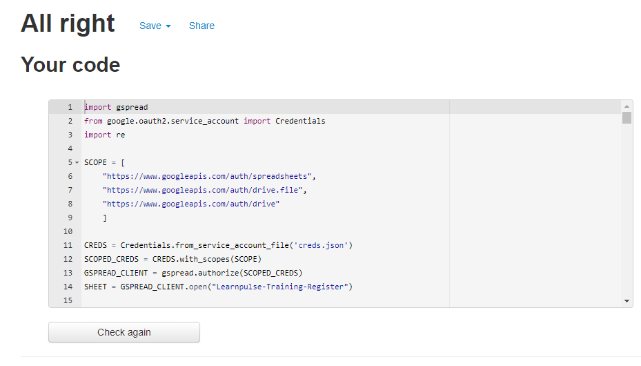
# **Deploying the site**
## **Deploying the application to Heroku**
This project was deployed on Heroku and should you wish to clone the project and deploy it yourself, you will need to follow these steps:  
1. Go through your Python code and anywhere where you have used the input() method, add a “\n” newline character into the block. This will allow the string you have written within the method to be shown when deployed to the mock terminal.
2. Now, you need to add the dependencies required for the project into the requirements.txt file. Without adding these dependencies in, the project will not function as intended, so this is an extremely important step. The environment I used to complete the project was pre-prepared with most of the code to deploy the project but I manually installed some separate dependencies during the development process which are listed below.
    * Google Auth
    * Gspread  

    To update the requirements.txt file with the relevant dependencies, you must enter the following command into the terminal “pip3 freeze > requirements.txt”.  
    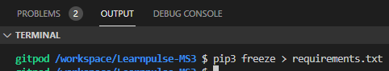  
    You will now see in the requirements.txt file that the dependencies for the project have been added. Heroku will search for this file and install the dependencies in the deployed version of the project which will allow it to work.  
    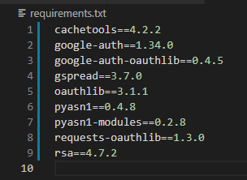  
    Once the requirement.txt file has been updated, commit and push the code to GitHub.  
3. Go to [Heroku](https://id.heroku.com/login) and sign up for a new account by filling out the registration form, verifying your email address and setting a password. Once that is complete, you can click the “set password and log in” button.
4. At this point, you will be presented with your Heroku dashboard which should look similar to the image below depending on whether you have used Heroku before. If you have not used Heroku previously, there will be no applications on your dashboard. To begin the deployment process, find the “Create new app” button and click it.
5. You will now need to enter a unique name for your app, Heroku will tell you if it is available or not.  
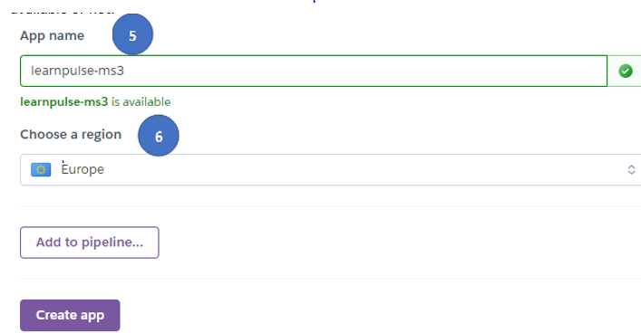  
6. You will also need to amend the location to the option that is relevant for you, as I live in Europe, I have selected Europe.
7. On the next page, you will have a toolbar with several options on it as circled in the image below. The tabs required to deploy the project are the “Deploy” tab and the “Settings” tab.
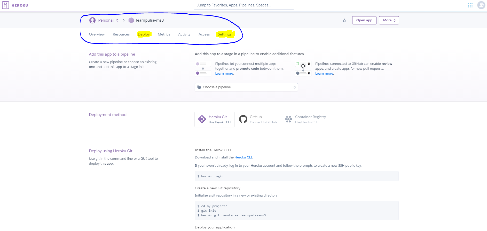
8. To begin deploying the project, you will first need to apply some specific settings. You can do this by clicking the “settings” tab and then following the below steps:
    * The first section that needs attention in the settings tab is the “Config Vars” section:  
    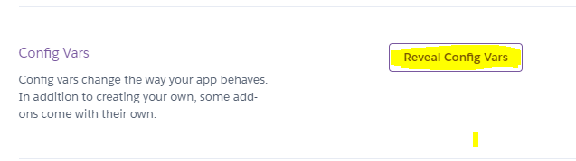  
    As the project requires the use of an API and in turn the creds.json file containing sensitive information which is itself protected inside the gitignore folder of the workspace, we will need to create a Config Var to allow the deployed project to utilise the credentials in the json file which will enable the application’s functionality. To create the relevant config var, click the “Reveal Config Vars” button:  
    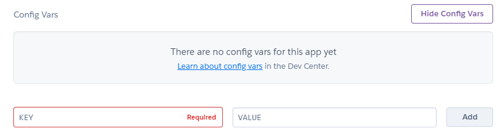  
    In the KEY field, enter “CREDS” in all caps, and in the VALUE field paste the entirety of the text content from the creds.json file from the workspace so that it looks something similar to the below screenshot:  
    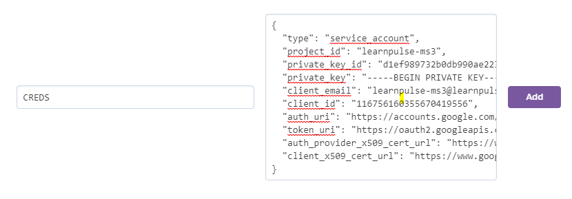  
    Once filled out, click “Add”.  
    * The next step in the “Settings” tab is to scroll down until you can see the build packs section. Adding buildpacks will allow the project to access additional dependencies to the ones in the requirement.txt file. When you see it, click “Add Buildpack”:  
    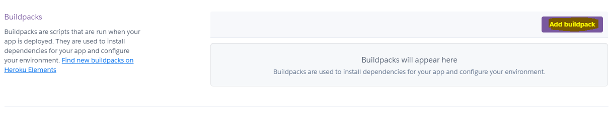  
    * From the options, select “python” and then click “save changes”. Then, click “add buildpack” again and select “node.js” and again click “save changes”.
    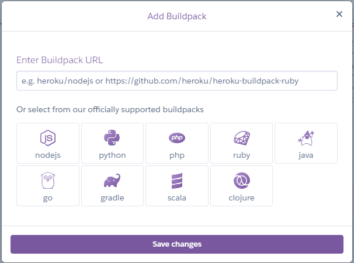  
    * You must ensure that the build packs you have selected are in the following order with Python on top and Node.js on the bottom, if you find that your build packs are in the wrong order, click and hold the hamburger to the left of the build pack log and drag them into the correct order:  
    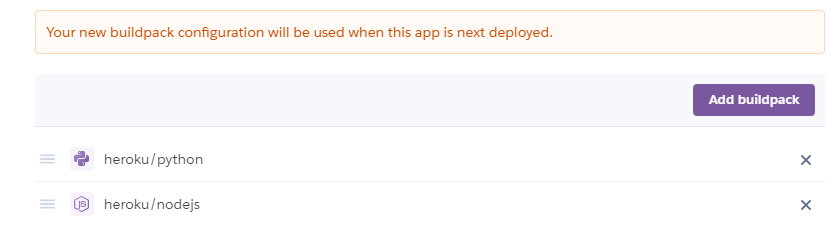  
    Once this is complete, you can scroll back up to the tool bar and move on to the “Deploy” tab.
9. In this section, you must select a deployment method. When I deployed the project, I connected Heroku to the GitHub repository containing the code. If you would like to deploy in the same manner, select the GitHub button and enter your GitHub repository name exactly as it is formatted on GitHub and then click “Search”:  
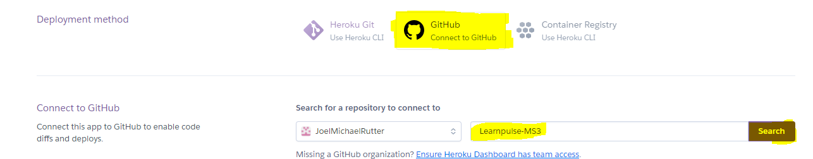  
10. Just beneath the field you just edited, provided you have entered all the information correctly, a small line will appear with a “Connect” button next to it. Click the “Connect” button:  
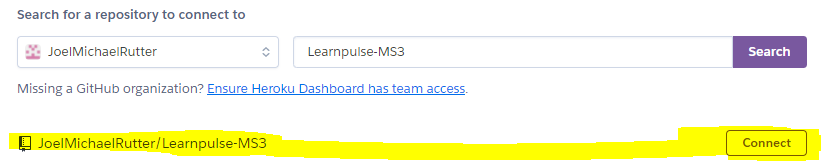  
When Heroku has successfully connected to GitHub repository, you will see a confirmation message like the below image:  
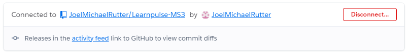  
11. Scroll down until you see the deployment section. There are two deployment options available to you which are explained below. 
    * Automatic deploys – This method of deployment will cause Heroku to redeploy the application whenever new code is pushed to GitHub.  
    * Manual Deploys – This method of deployment will build the application based on the current state of the code branch you select. For the purposes of the document, I used the manual deployment method by clicking “Deploy Branch”.  
    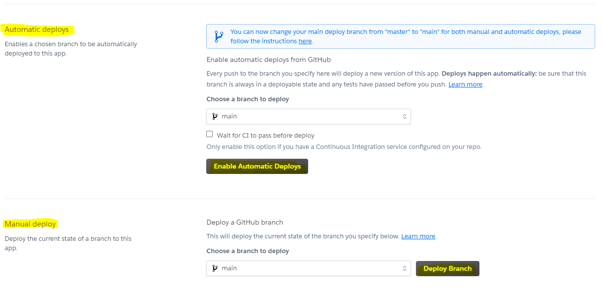  
    This will show the application being built in a small window where you can see the dependencies and packages necessary for the application to run being installed.  
    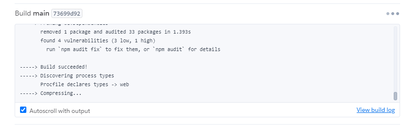  
    Once the application is fully built, you can access view the deployed application by clicking the “View” button:  
    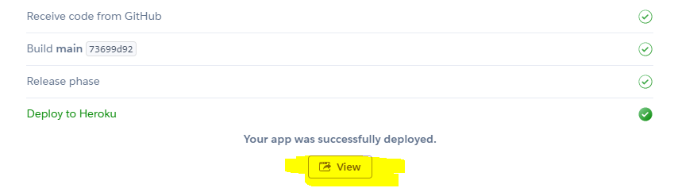
## **Forking The Repository**
Should you wish to use the site code inside the repository without affecting the original repository, you can make a fork and create a copy of the repository which you can view and amend the code within. To create a fork, follow these steps:  
1. Login to GitHub and locate the [Learnpulse-MS3](https://github.com/JoelMichaelRutter/Learnpulse-MS3) repository.
2. In the top right-hand corner of the repository, you will see three buttons just below your profile icon. The rightmost button is called “fork”. Click this button.  
  
The repository will now be copied to your own GitHub account.
## **Cloning The Repository
You can create a clone of the repository inside your development environment via https. To do this, follow these steps:  
1. Login to GitHub and locate the locate the [Learnpulse-MS3](https://github.com/JoelMichaelRutter/Learnpulse-MS3) repository.
2. Whilst in the repository, you will see the various files contained within. Above this list, you will see a button labelled “code”. The button will have a small download icon beside it.  

3. When you click this icon, a small dropdown will open. Inside the dropdown will be the URL for the deployed site. Copy this URL by clicking the clipboard icon.  
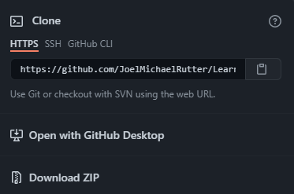
4. Whilst in the development environment, navigate to the bash terminal. In the bash terminal, enter “git clone”, then paste in the URL copied from the GitHub repository and hit enter. 
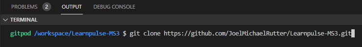  
A clone of all files will now be pulled into the workspace.
# **Project Reflection**
I have enjoyed this project the most out of the ones I have done already. I really didn’t struggle to get things off the ground with this one like I did with my JavaScript project. I feel like working with Python has only solidified my understanding of the principles I learned during the JS module. I am excited to see where I can develop my skills further and understand how these back end skills, I have developed will relate to front end skills. 
# **Further Development Scope**
Whilst simple in scope, I have developed this application to have lots of scope. Some specific ideas that I had are:
* **Multiple Worksheets** – In a real-life situation, a busines may wish to keep their staff separated on different worksheets. On that basis, the order of the program could change and branch into more sections utilising the same functions here depending on the team assignment command. Further refactoring would be required to ensure that the code updated the correct worksheet.
* **Trainee Removal** – The ability to remove a trainee if they left the business would be a welcome addition, the best way to do this would be to branch the program at the welcome function and add in a new branch of code to deal with deleting rows from the worksheet.
* **Further Insights** – Whilst the scope of the trainee data collected is limited, functionality could be built into the application to delve further into a trainee’s performance and tell the user when refresher training is due.
# **Project Credits**
## **Code**
All code acknowledgements have been inserted into the code in the appropriate points but for clarity, I have included them here as well.
* Code Institutes Full Stack Software Development Course for providing their course content for me to look back on, specifically when it came to deployment of the project. 
* **Stack Overflow Community**
    * Particularly “Misterlen” for his contribution on [this]( https://bit.ly/2VIyBJU) thread which assisted me with the REGEX I needed for my full name input.
    * Thanks to “Nikko J.” on [this]( https://bit.ly/2VMS4cc) stack overflow thread which helped me implement my search functionality.
* **SoftHints**
    * Particularly [this]( https://blog.softhints.com/python-regex-match-date/#regexmatchingdate10102015) article about regex for data matching which was supplied by Sheryl from Tutor Support.
# **Project Acknowledgements**
I would finally like to thank the following people for their help and guidance:
* Chris Quinn – my mentor for being brilliant as usual.
* Tutor Support – Big props as always for helping me pull my finger out and fix things myself.
* Charlotte Howard - my partner in crime, for proof reading this document.

